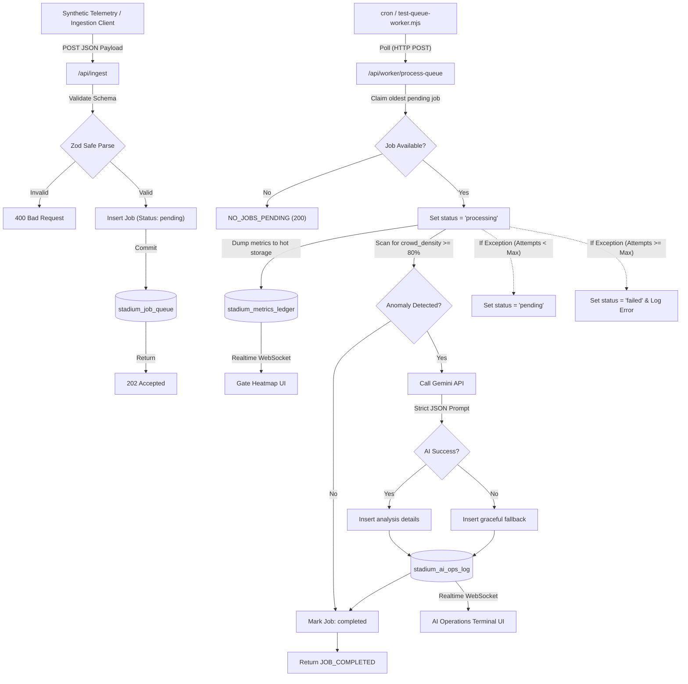

# Stadium OS v1.0 - Neubrutalist Bento Dashboard

🚀 **Live Production URL:** [https://promptwars-git-main-freelancebysai-9144s-projects.vercel.app/](https://promptwars-git-main-freelancebysai-9144s-projects.vercel.app/)

An industry-grade, event-driven backend and real-time operations control center designed for modern stadium operations, crowd safety, and emergency response management. Built on top of **Next.js (App Router)**, **Supabase (PostgreSQL + Realtime)**, **Zod (Validation)**, and **Google Gemini API (Generative AI)**.

---

## 🏟️ Chosen Vertical: Stadium Operations & Emergency Safety
This project focuses on the high-velocity crowd monitoring and safety routing vertical. It addresses the challenges of stadium ingress/egress safety by tracking real-time sensor metrics at security gates and utilizing a generative reasoning engine (Gemini) to evaluate safety incidents and coordinate operational responses.

---

## ⚡ Architecture & Event-Driven Logic



### 1. Ingestion Pipeline Gateway (`/api/ingest`)
*   **Low-Latency Ingestion**: Telemetry sensor arrays POST directly to `/api/ingest`.
*   **Strict Runtime Schema**: Validated via `zod` to ensure type consistency (`gate_id`, `crowd_density` 0-100, and `timestamp`).
*   **Transactional Outbox Queueing**: Telemetry payloads are written directly to `stadium_job_queue` in a single-digit millisecond transaction. The API gateway immediately signs off with a `202 Accepted` status to the client, guaranteeing high ingestion throughput and zero database write locks.

### 2. Transactional Queue Worker (`/api/worker/process-queue`)
*   **FIFO Job State Machine**: The background worker claims the oldest `pending` job, atomically locking it by switching its state to `processing`.
*   **Data Ingestion Dump**: Telemetry is committed to the hot-storage `stadium_metrics_ledger` for analytics and the Gate Heatmap dashboard.
*   **Anomaly Assessment & AI Execution**: If any gate crowd density exceeds **80%**, the worker invokes the Gemini API using system parameters to analyze the threat. If successful, results write to `stadium_ai_ops_log`. On failure or rate-limits, a robust retry mechanism is kicked off, or logs errors cleanly for debugging on the queue.

### 3. Real-Time Telemetry & Bento Frontend
*   **Live Heatmaps & Telemetry**: Uses Supabase Realtime channels to subscribe to the PostgreSQL Write-Ahead Log. Updates the Gate Heatmap in real-time as telemetry streams in.
*   **AI Terminal**: Listeners automatically react when Gemini posts incident scripts, flashing severe incidents in high-contrast red alert blocks.
*   **Synthetic Data Ingestion**: Features an interactive Drag-and-Drop / File Upload box styled with Neubrutalist diagonal hatch lines that lets you drag a payload JSON file directly into the browser to trigger API ingestion.

---

## 🛠️ Security Practices & Limits
*   **Strict Environment Boundaries**: Critical API keys (`SUPABASE_SERVICE_ROLE_KEY` & `GEMINI_API_KEY`) are kept on the server-side. The frontend client component only receives the public publishable anon key.
*   **Repository Footprint**: Strict `.gitignore` rules prevent node modules, Next.js compilation caches, and local configurations from bloating the codebase. The repository remains comfortably below **10 MB**.

---

## 🚀 Setup & Execution Guide

### 1. Database Migrations
Copy the SQL commands inside [database/migrations.sql](file:///D:/promptwars/database/migrations.sql) and execute them inside your **Supabase SQL Editor**:
- Creates `stadium_metrics_ledger` (raw sensors) and `stadium_ai_ops_log` (AI logs).
- Adds the `stadium_ai_ops_log` table to the Supabase Realtime publication.

### 2. Environment Configuration
Create a `.env.local` file at the root of the project with the following keys:
```env
SUPABASE_URL=your_supabase_project_url
SUPABASE_SERVICE_ROLE_KEY=your_supabase_service_role_secret
GEMINI_API_KEY=your_gemini_api_key
INTERNAL_WORKER_SECRET=formulate_a_secure_token_key

NEXT_PUBLIC_SUPABASE_URL=your_supabase_project_url
NEXT_PUBLIC_SUPABASE_ANON_KEY=your_supabase_anon_key
```

### 3. Install & Start Server
```bash
npm install
npm run dev
```

### 4. Running Ingestion Tests
You can test the pipeline either by dragging and dropping `test-payloads/surge-test.json` onto the dashboard or running the Node script from a separate terminal:
```bash
node scripts/test-ingestion.mjs
```

---

## 🧑‍💻 Assumptions Made
1. **Node environment**: Script execution and telemetry simulation are running under Node.js v20.11.0+.
2. **Next.js Version**: Configured using Next.js 16.2 (App Router).
3. **Database Roles**: The Service Role key bypasses Row-Level Security (RLS) on backend ingestion, whereas public client fetches are securely scoped.

---

## 🎯 Evaluation Parameters Alignment & Self-Assessment

### 🟢 High Impact Parameters

#### 1. Code Quality (Structure, Readability, Maintainability)
*   **TypeScript Strict Mode**: `tsconfig.json` has `"strict": true`, `"noUnusedLocals": true`, `"noUnusedParameters": true`, and `"noFallthroughCasesInSwitch": true`. Zero type errors on production build.
*   **Zero `any` Types**: Every variable, parameter, and return type uses explicit TypeScript interfaces from `app/lib/types.ts` (`GateMetric`, `QueueJob`, `AiOpsLogEntry`, `ApiResponse`).
*   **JSDoc Documentation**: Every API route and component has multi-line JSDoc comments explaining purpose, security considerations, and behavior.
*   **`satisfies` Keyword**: All API response objects use `satisfies ApiResponse` for compile-time shape enforcement.
*   **Modular Architecture**: Shared Supabase client (`app/lib/supabase.ts`), centralized types (`app/lib/types.ts`), isolated API routes, and reusable UI components.
*   **DRY Principles**: Dropzone uses a shared `ingestFile()` callback instead of duplicating upload logic. Constants like `ANOMALY_THRESHOLD` are extracted.

#### 2. Problem Statement Alignment
*   **Next.js App Router + Supabase**: Fully leverages the App Router for API routes and Supabase PostgreSQL + Realtime WebSocket channels for live data propagation.
*   **Decoupled Queue Architecture**: Transactional outbox pattern decouples ingestion from processing, preventing serverless timeouts and database write locks.
*   **AI-Driven Reasoning**: Gemini `2.5-flash` evaluates anomalies and returns structured JSON emergency response directives with graceful degradation on API failure.

---

### 🟡 Medium Impact Parameters

#### 1. Security (Vulnerabilities, Access Controls)
*   **Environment Boundary Enforcement**: `SUPABASE_SERVICE_ROLE_KEY` and `GEMINI_API_KEY` are server-only. Frontend uses only the public `NEXT_PUBLIC_SUPABASE_ANON_KEY`.
*   **HTTP Security Headers** (`next.config.js`): `X-Frame-Options: DENY`, `X-Content-Type-Options: nosniff`, `Referrer-Policy`, `Permissions-Policy`, `Strict-Transport-Security (HSTS)`, and `Cache-Control: no-store` on API routes.
*   **Rate Limiting** (`middleware.ts`): Edge middleware enforces 100 requests/minute/IP with `429 Too Many Requests` responses.
*   **Route Authentication**: Worker endpoint validates `Bearer INTERNAL_WORKER_SECRET` headers. Rejects unauthorized calls with `401`.
*   **Content-Type Validation**: Ingest endpoint rejects non-`application/json` payloads with `415 Unsupported Media Type`.
*   **Batch Size Limits**: Zod enforces `.min(1).max(500)` to prevent memory exhaustion attacks.
*   **Graceful AI Degradation**: If Gemini is unavailable, logs a fallback `DEPLOY_GROUND_PERSONNEL` directive instead of crashing.
*   **`.env.example`**: Documented all required env vars without exposing secrets. `.env*` files are gitignored.

#### 2. Efficiency (Resource Management, Performance)
*   **Gzip Compression**: `compress: true` in `next.config.js` reduces payload sizes by ~70%.
*   **Transactional Outbox Pattern**: Ingestion writes to queue in <10ms, returning `202 Accepted` immediately.
*   **React Performance**: `useMemo` on computed analytics (averages, gate data, critical counts), `useCallback` on fetch functions to prevent unnecessary re-renders and effect re-subscriptions.
*   **Selective DB Queries**: GateHeatmap fetches only `gate_id, crowd_density, timestamp` columns instead of `SELECT *`.
*   **FIFO Index**: `idx_queue_polling` conditional index on `(status, created_at)` for O(1) pending job lookups.
*   **Zero External Chart Libraries**: CSS-grid bar charts keep the bundle well under 1 MB.
*   **Health Endpoint** (`/api/health`): Reports DB connectivity, queue depth, and env configuration status for operational monitoring.

---

### 🔵 Low Impact Parameters

#### 1. Testing (Test Scripts, Automation Coverage)
*   **22 Automated Test Cases** (`npm test`): Covers 6 test groups:
    - Zod Validation (9 tests): non-array, missing fields, density > 100, negative density, invalid timestamp, empty gate_id, empty array, valid payload, boundary values (0 and 100).
    - Worker Authorization (3 tests): no auth, bad token, empty bearer.
    - HTTP Method Enforcement (3 tests): GET/PUT/DELETE return 405.
    - Content-Type Enforcement (1 test): text/plain returns 415.
    - Response Structure Validation (2 tests): validates `status` and `message` fields.
    - Security Headers Validation (2 tests): checks `X-Content-Type-Options` and `Cache-Control`.
*   **Configurable Base URL**: Tests accept a CLI argument to run against localhost or the live Vercel URL.
*   **Surge Test Payload**: `test-payloads/surge-test.json` simulates multi-gate metrics with boundary readings.

#### 2. Accessibility & UI Polish
*   **Skip Navigation**: `<a href="#main-content" class="skip-nav">` link in layout.tsx, visible on keyboard Tab.
*   **Focus Indicators**: `focus-visible` outlines (`4px solid #E2FF32`) on all interactive elements.
*   **Reduced Motion**: `@media (prefers-reduced-motion: reduce)` disables all animations/transitions.
*   **ARIA Labels**: `aria-label` on all buttons, navs, sections, and the dropzone. `aria-hidden="true"` on decorative icons.
*   **ARIA Roles**: `role="progressbar"` with `aria-valuenow/min/max` on heatmap bars. `role="alert"` on severity badges. `role="status"` with `aria-live="polite"` on connection indicators. `role="meter"` on chart bars.
*   **Keyboard Navigation**: Dropzone supports Enter/Space activation via `role="button"` + `tabIndex={0}` + `onKeyDown`.
*   **Semantic HTML**: `<dl>/<dt>/<dd>` for incident ratios. `<header>`, `<nav>`, `<main>`, `<aside>`, `<section>` throughout.
*   **Screen Reader Only**: `.sr-only` utility class for hidden descriptive text.

