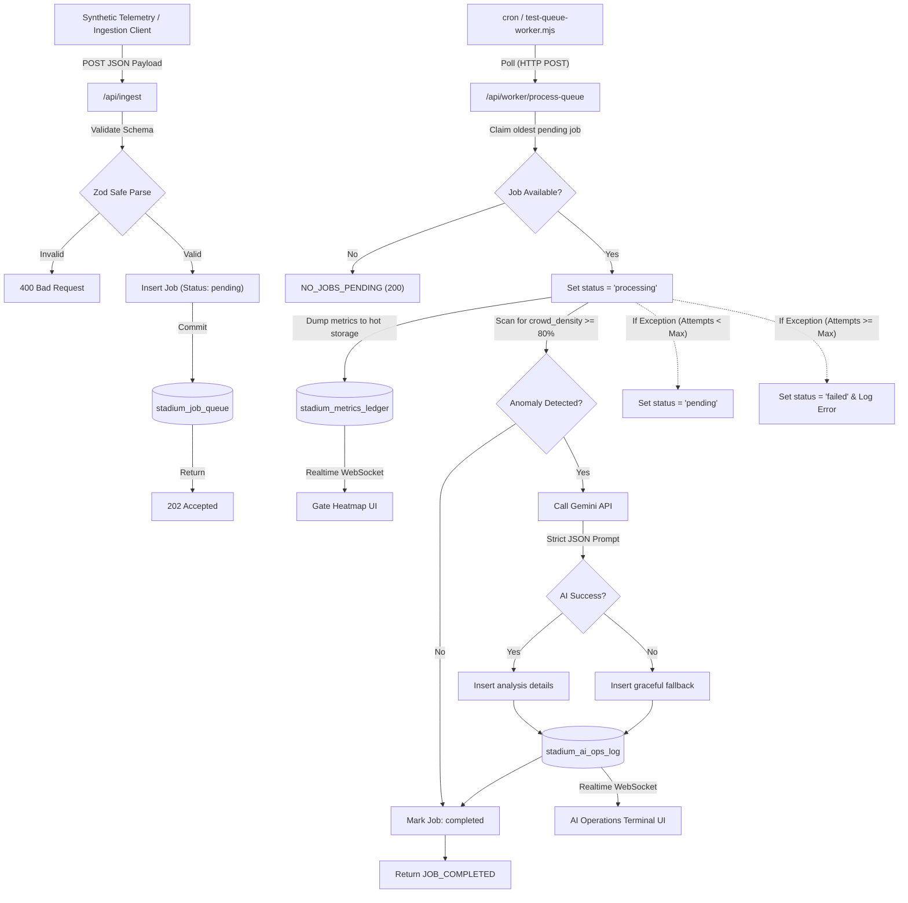

# Stadium OS v1.0 - Neubrutalist Bento Dashboard

🚀 **Live Production URL:** [https://promptwars-git-main-freelancebysai-9144s-projects.vercel.app/](https://promptwars-git-main-freelancebysai-9144s-projects.vercel.app/)

An industry-grade, event-driven backend and real-time operations control center designed for modern stadium operations, crowd safety, and emergency response management. Built on top of **Next.js (App Router)**, **Supabase (PostgreSQL + Realtime)**, **Zod (Validation)**, and **Google Gemini API (Generative AI)**.

---

## 🏟️ Chosen Vertical: Stadium Operations & Emergency Safety
This project focuses on the high-velocity crowd monitoring and safety routing vertical. It addresses the challenges of stadium ingress/egress safety by tracking real-time sensor metrics at security gates and utilizing a generative reasoning engine (Gemini) to evaluate safety incidents and coordinate operational responses.

---

## ⚡ Architecture & Event-Driven Logic



### 1. Ingestion Pipeline Gateway (`/api/ingest`)
*   **Low-Latency Ingestion**: Telemetry sensor arrays POST directly to `/api/ingest`.
*   **Strict Runtime Schema**: Validated via `zod` to ensure type consistency (`gate_id`, `crowd_density` 0-100, and `timestamp`).
*   **Transactional Outbox Queueing**: Telemetry payloads are written directly to `stadium_job_queue` in a single-digit millisecond transaction. The API gateway immediately signs off with a `202 Accepted` status to the client, guaranteeing high ingestion throughput and zero database write locks.

### 2. Transactional Queue Worker (`/api/worker/process-queue`)
*   **FIFO Job State Machine**: The background worker claims the oldest `pending` job, atomically locking it by switching its state to `processing`.
*   **Data Ingestion Dump**: Telemetry is committed to the hot-storage `stadium_metrics_ledger` for analytics and the Gate Heatmap dashboard.
*   **Anomaly Assessment & AI Execution**: If any gate crowd density exceeds **80%**, the worker invokes the Gemini API using system parameters to analyze the threat. If successful, results write to `stadium_ai_ops_log`. On failure or rate-limits, a robust retry mechanism is kicked off, or logs errors cleanly for debugging on the queue.

### 3. Real-Time Telemetry & Bento Frontend
*   **Live Heatmaps & Telemetry**: Uses Supabase Realtime channels to subscribe to the PostgreSQL Write-Ahead Log. Updates the Gate Heatmap in real-time as telemetry streams in.
*   **AI Terminal**: Listeners automatically react when Gemini posts incident scripts, flashing severe incidents in high-contrast red alert blocks.
*   **Synthetic Data Ingestion**: Features an interactive Drag-and-Drop / File Upload box styled with Neubrutalist diagonal hatch lines that lets you drag a payload JSON file directly into the browser to trigger API ingestion.

---

## 🛠️ Security Practices & Limits
*   **Strict Environment Boundaries**: Critical API keys (`SUPABASE_SERVICE_ROLE_KEY` & `GEMINI_API_KEY`) are kept on the server-side. The frontend client component only receives the public publishable anon key.
*   **Repository Footprint**: Strict `.gitignore` rules prevent node modules, Next.js compilation caches, and local configurations from bloating the codebase. The repository remains comfortably below **10 MB**.

---

## 🚀 Setup & Execution Guide

### 1. Database Migrations
Copy the SQL commands inside [database/migrations.sql](file:///D:/promptwars/database/migrations.sql) and execute them inside your **Supabase SQL Editor**:
- Creates `stadium_metrics_ledger` (raw sensors) and `stadium_ai_ops_log` (AI logs).
- Adds the `stadium_ai_ops_log` table to the Supabase Realtime publication.

### 2. Environment Configuration
Create a `.env.local` file at the root of the project with the following keys:
```env
SUPABASE_URL=your_supabase_project_url
SUPABASE_SERVICE_ROLE_KEY=your_supabase_service_role_secret
GEMINI_API_KEY=your_gemini_api_key
INTERNAL_WORKER_SECRET=formulate_a_secure_token_key

NEXT_PUBLIC_SUPABASE_URL=your_supabase_project_url
NEXT_PUBLIC_SUPABASE_ANON_KEY=your_supabase_anon_key
```

### 3. Install & Start Server
```bash
npm install
npm run dev
```

### 4. Running Ingestion Tests
You can test the pipeline either by dragging and dropping `test-payloads/surge-test.json` onto the dashboard or running the Node script from a separate terminal:
```bash
node scripts/test-ingestion.mjs
```

---

## 🧑‍💻 Assumptions Made
1. **Node environment**: Script execution and telemetry simulation are running under Node.js v20.11.0+.
2. **Next.js Version**: Configured using Next.js 16.2 (App Router).
3. **Database Roles**: The Service Role key bypasses Row-Level Security (RLS) on backend ingestion, whereas public client fetches are securely scoped.
